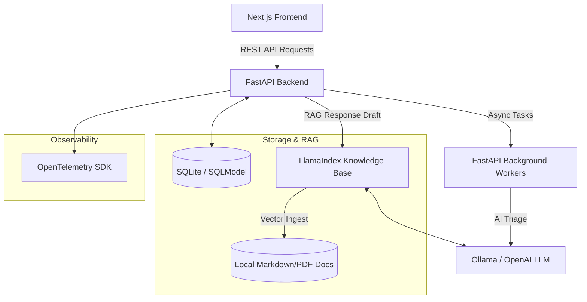

# SmartOps AI

SmartOps AI is an intelligent, agent-in-the-loop support operations assistant. It automates ticket triage, routing, and knowledge retrieval while giving human operators final approval control.

---

### **Business Problem & Purpose**
> **Customer support operations frequently suffer from high ticket volumes, delayed SLA response times, and fragmented internal knowledge bases. Human agents spend significant time on manual triage, category assignment, and looking up repeated queries across SOP policies. This overhead causes high operational costs and customer dissatisfaction.**
>
> **SmartOps AI solves this by acting as an intelligent middleware: ingest tickets in real-time, instantly run automated background categorization and priority classification, draft accurate replies grounded exclusively in company documentation, and present these drafts directly to human agents for editing and approval before sending.**

---

## 🏗️ System Architecture



---

## 🚀 Key Features

* **Unified Support Desk UI:** Dashboard showing active ticket queues, categories, priority badges, and AI confidence levels.
* **Automated AI Triage:** Automatic category classification (`Technical`, `Billing`, `General`, `Feature Request`) and priority routing (`low`, `medium`, `high`, `urgent`).
* **Background Processing:** Async background triage runs instantly upon ingestion to eliminate API blocking.
* **RAG-Grounded Response Drafting:** Suggests email replies utilizing local knowledge document indices via LlamaIndex.
* **Supervisor Approval Workflow:** Human-in-the-loop interface allowing agents to review, modify, and approve AI-generated drafts.
* **Analytics Dashboard:** Real-time metrics tracking ticket volume, resolution rates, category distributions, and average AI confidence.
* **Full-Stack Observability:** Built-in OpenTelemetry tracing for API routes and database transactions.

---

## 🛠️ Technical Challenges & Decisions

### 1. Handling Local LLM Output Variance
* **Problem:** Local LLMs (like `llama3.2:1b`) occasionally output conversational noise instead of clean JSON required for automated triage schemas.
* **Solution:** Configured `LLMTextCompletionProgram` with strict Pydantic model validation. Added an error fallback handler that maps tickets to a default `General` category and `medium` priority if the LLM fails to comply or is offline, protecting the ingestion pipeline.

### 2. SQLModel Startup Lifecycle & Foreign Keys
* **Problem:** Encountered `NoReferencedTableError` during database initialization because models were imported out of order during execution.
* **Solution:** Consolidated model registrations (User, Ticket) directly inside the initialization startup hook (`app/main.py`), ensuring SQLite foreign key definitions are resolved correctly at engine creation time.

### 3. Hydration Warnings in Next.js Sidebar
* **Problem:** React hydration warnings were thrown due to incorrect nesting of Link components inside the shadcn sidebar menu structure.
* **Solution:** Refactored the `AppSidebar` component to cleanly use Next.js `Link` structures inside rendering callbacks without nested `a` element collisions.

### 4. Test DB Isolation with SQLite Memory Engines
* **Problem:** Standard connection rollback strategies caused unique constraint failures on consecutive test runs when test cases executed database commits.
* **Solution:** Configured a pytest fixture in `conftest.py` that builds and drops the SQLite database schema dynamically for each test, ensuring isolated environments and clean states.

---

## 🛠️ Setup & Running

### Using Docker (Recommended)
1. Ensure you have Docker and Docker Compose installed.
2. Configure your variables in a `.env` file (e.g. `LLM_PROVIDER`, `OPENAI_API_KEY`).
3. Build and launch:
   ```bash
   docker-compose up --build
   ```
4. Access the **Dashboard** at `http://localhost:3000` and the **API Docs** at `http://localhost:8000/docs`.

### Manual Local Running

#### Prerequisites
* Python 3.12+ (managed via `uv` or `venv`)
* Node.js 18+

#### 1. Backend Setup
```bash
cd backend
uv sync
uv run uvicorn app.main:app --port 8000 --reload
```

#### 2. Frontend Setup
```bash
cd frontend
npm install
npm run dev
```

---

## 🧪 Testing

The backend contains a complete suite of unit and integration tests covering API endpoints, background routing, and RAG drafting services.

To run the backend test suite:
```bash
cd backend
uv run python -m pytest
```
